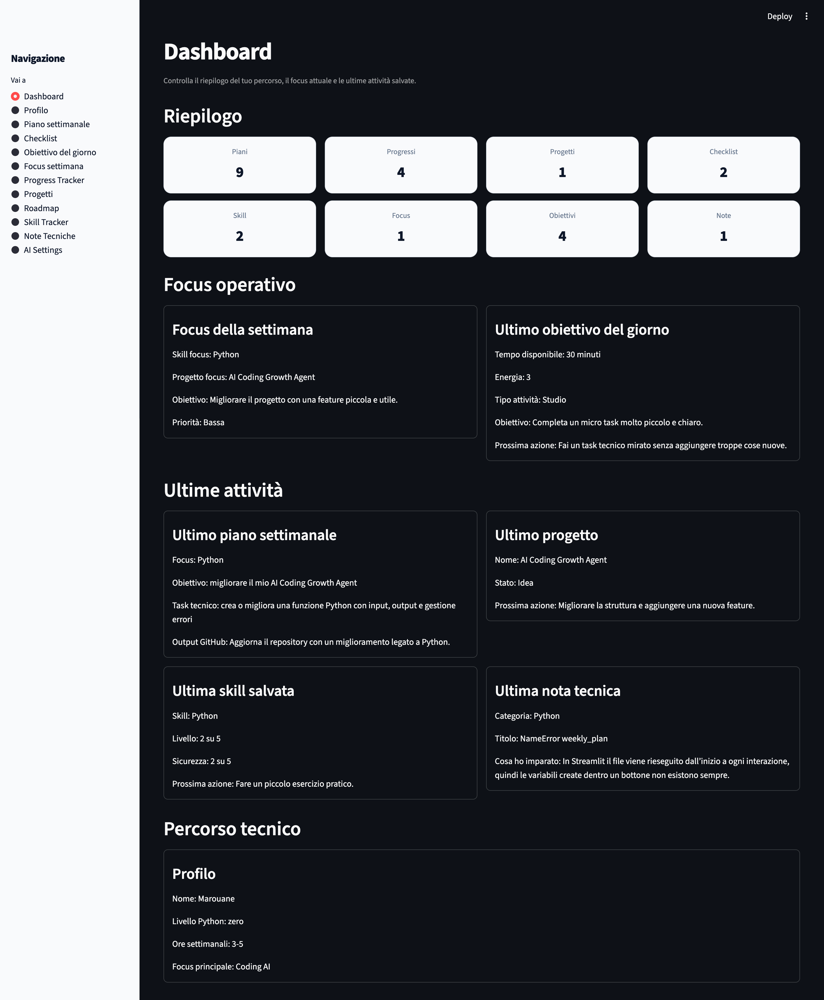

# AI Coding Growth Agent

AI Coding Growth Agent è una mini app personale costruita con Python e Streamlit.

L'obiettivo è aiutarmi a pianificare il mio percorso nel Coding AI, partendo dal mio livello attuale, dal tempo disponibile ogni settimana e dai progressi reali.

## Screenshot

### Dashboard



## Stack

- Python
- Streamlit
- JSON

## Funzionalità attuali

- Dashboard riepilogativa
- Profilo personale modificabile
- Salvataggio dati in JSON
- Generatore piano settimanale
- Piano settimanale leggibile
- Progress tracker
- Storico progressi leggibile
- Sezione progetti
- Storico progetti leggibile
- Roadmap 3 mesi
- Navigazione tramite sidebar
- Codice organizzato in moduli
- Export del piano settimanale in Markdown
- Sezione checklist
- Storico checklist leggibile
- Eliminazione ultimo piano salvato
- Eliminazione ultima checklist salvata
- Eliminazione ultimo progresso salvato
- Eliminazione ultimo progetto salvato
- Skill Tracker
- Focus settimana
- Contatore skill nella Dashboard
- Contatore focus nella Dashboard
- Visualizzazione ultima skill salvata nella Dashboard
- Visualizzazione focus settimanale nella Dashboard
- Planner migliorato con contesto da Skill Tracker
- Planner migliorato con contesto da Focus settimana
- Raccomandazione skill nel piano settimanale
- Focus settimanale collegato al piano
- Export Markdown aggiornato con raccomandazioni
- Obiettivo del giorno
- Storico obiettivi del giorno
- Eliminazione ultimo obiettivo salvato
- Visualizzazione ultimo obiettivo del giorno nella Dashboard
- Contatore obiettivi giornalieri nella Dashboard
- Note tecniche
- Storico note tecniche
- Eliminazione ultima nota tecnica
- Visualizzazione ultima nota tecnica nella Dashboard
- Contatore note tecniche nella Dashboard
- UI migliorata con CSS personalizzato
- Dashboard organizzata in card
- Metriche Dashboard su card personalizzate
- Form uniformati nelle sezioni principali
- Layout a card per Piano settimanale
- Layout a card per Progress Tracker
- Layout a card per Skill Tracker
- Layout a card per Focus settimana
- Layout a card per Obiettivo del giorno
- Layout a card per Progetti
- Layout a card per Note Tecniche
- Gestione sicura della modalità AI disattivata
- Warning UI quando API reale non è ancora implementata
- AI Settings collegato a Piano settimanale e Obiettivo del giorno
- Learning Plan
- Storico learning plan
- Eliminazione ultimo learning plan
- Visualizzazione ultimo learning plan nella Dashboard
- Contatore Learning nella Dashboard
- Refactor del mock AI client con funzioni dedicate per ogni modalità
- Mock AI dinamico con keyword detection sul prompt
- Learning Plan collegato ad AI Settings

### Setup con Poetry

```bash
poetry install
poetry run streamlit run app.py
- Validazione dati con Pydantic per Skill, Daily Goal e Projects

## AI mock mode

Il progetto include una prima struttura per l’integrazione AI tramite `utils/ai_client.py`.

Per ora non vengono usate API esterne. Il sistema usa una modalità mock per simulare suggerimenti AI nelle sezioni:

- Piano settimanale
- Obiettivo del giorno

Questa scelta permette di sviluppare e testare la logica dell’app senza costi, senza chiavi API e senza dipendere da servizi esterni.


## Configurazione futura API

Il file `.env.example` mostra le variabili previste per una futura integrazione:

```text
AI_PROVIDER=openai
AI_MODEL=gpt-4.1-mini
OPENAI_API_KEY=your_api_key_here
USE_MOCK_AI=true
```

## Gestione API key

Il progetto usa `python-dotenv` per leggere variabili locali dal file `.env`.

Il file `.env` non viene caricato su GitHub perché è incluso nel `.gitignore`.

Se `USE_MOCK_AI=false` ma `OPENAI_API_KEY` non è configurata, l’app mostra un warning invece di andare in errore.

Questa gestione prepara il progetto per una futura integrazione con API reali mantenendo sicura la configurazione.


## Struttura progetto


aiCoding-growth-agent/
├── README.md
├── app.py
├── assets/
│   └── dashboard.png
├── app_pages/
│   ├── dashboard.py
│   ├── profile.py
│   ├── weekly_plan.py
│   ├── checklist.py
│   ├── daily_goal.py
│   ├── weekly_focus.py
│   ├── progress_tracker.py
│   ├── projects.py
│   ├── roadmap.py
│   ├── skill_tracker.py
│   └── technical_notes.py
│   └── learning.py
├── utils/
│   ├── json_handler.py
│   ├── planner_rules.py
│   └── markdown_exporter.py
│   └── ai_clients.py
├── data/
│   └── ai_settings.json
│   └── checklists.json
│   └── daily_goals.json
│   └── learning_plans.json
│   └── learning.json
│   └── profile.json
│   └── progress.json
│   └── projects.json
│   └── roadmap.json
│   └── skills.json
│   └── technical_notes.json
│   └── weekly_focus.json
│   └──weekly_plan.json
├── exports/
├── requirements.txt
└── .gitignore


## Roadmap

### V1 completata

- Dashboard
- Profilo personale
- Piano settimanale
- Checklist
- Progress tracker
- Progetti
- Roadmap 3 mesi
- Export Markdown
- Salvataggio JSON
- Sidebar di navigazione
- Storici leggibili
- Eliminazione ultimo record salvato

### V2 in sviluppo

- Skill Tracker
- Focus settimana
- Obiettivo del giorno
- Note tecniche
- Dashboard più operativa
- Contatori aggiornati
- Visualizzazione ultima skill
- Visualizzazione focus settimanale
- Visualizzazione ultimo obiettivo del giorno
- Visualizzazione ultima nota tecnica
- Planner contestuale basato su skill e focus
- Export Markdown migliorato
- UI migliorata con CSS personalizzato
- Layout a card nelle sezioni principali
- Form uniformati

### Prossimi step V2

- Miglioramento regole del planner
- Sezione “Obiettivo del giorno”
- Migliore gestione dello storico
- Possibilità di modificare record salvati
- Prima preparazione per API LLM

### V3

- Integrazione API LLM
- Generazione piani più personalizzati
- Analisi automatica dei progressi
- Suggerimenti automatici sui prossimi task
- Supporto alla monetizzazione dei mini progetti

## Stato progetto

- V1 completata
- V2 in sviluppo
- UI migliorata
- Refactor completato con pagine separate
- Pubblicato su GitHub personale

## Cosa ho imparato

Durante lo sviluppo di questo progetto ho praticato:

- Creazione di una app con Streamlit
- Gestione dello stato tramite file JSON
- Organizzazione del codice in pagine separate
- Refactor progressivo di un file `app.py` troppo grande
- Creazione di una UI più ordinata con form, card e sidebar
- Uso di Git e GitHub su un repository personale
- Preparazione di una struttura mock AI senza usare API reali
- Gestione sicura delle variabili ambiente con `.env`
- Gestione degli errori in modo leggibile per l’utente

## Prossimi sviluppi

- Collegare una vera API LLM
- Aggiungere una pagina per modificare record salvati
- Migliorare la gestione dello storico
- Aggiungere filtri per skill, progetti e progressi
- Esportare più sezioni in Markdown
- Preparare una demo pubblica con Streamlit Community Cloud

## Collegamento con la specializzazione Agentic AI & Python

Questo progetto nasce dopo la specializzazione Aulab in Agentic AI & Python.

Competenze applicate:
- Python modulare
- gestione file JSON
- separazione tra UI e logica
- Git/GitHub
- gestione .env
- mock AI
- preparazione a integrazione API LLM

Competenze da integrare in futuro:
- Poetry
- Pydantic
- FastAPI
- RAG
- Agents
- LangChain/LangGraph

## Recap AI Coding Growth Agent

Core:
- Streamlit app modulare
- app_pages per le pagine
- utils per logica riutilizzabile
- data per storage JSON

AI:
- Mock AI centralizzato
- AI Settings
- gestione .env
- fallback leggibile se API reale non è configurata

Validazione:
- Pydantic su Skill
- Pydantic su DailyGoal
- Pydantic su Project
- Pydantic su LearningPlan

Project setup:
- requirements.txt ancora presente
- pyproject.toml aggiunto
- poetry.lock aggiunto
- avvio con Poetry testato


